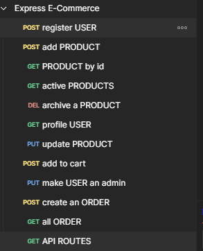
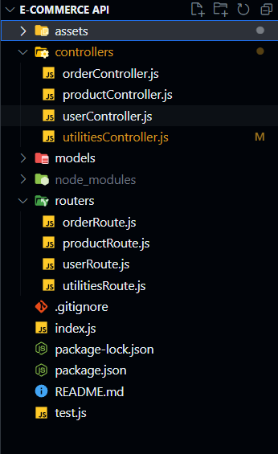
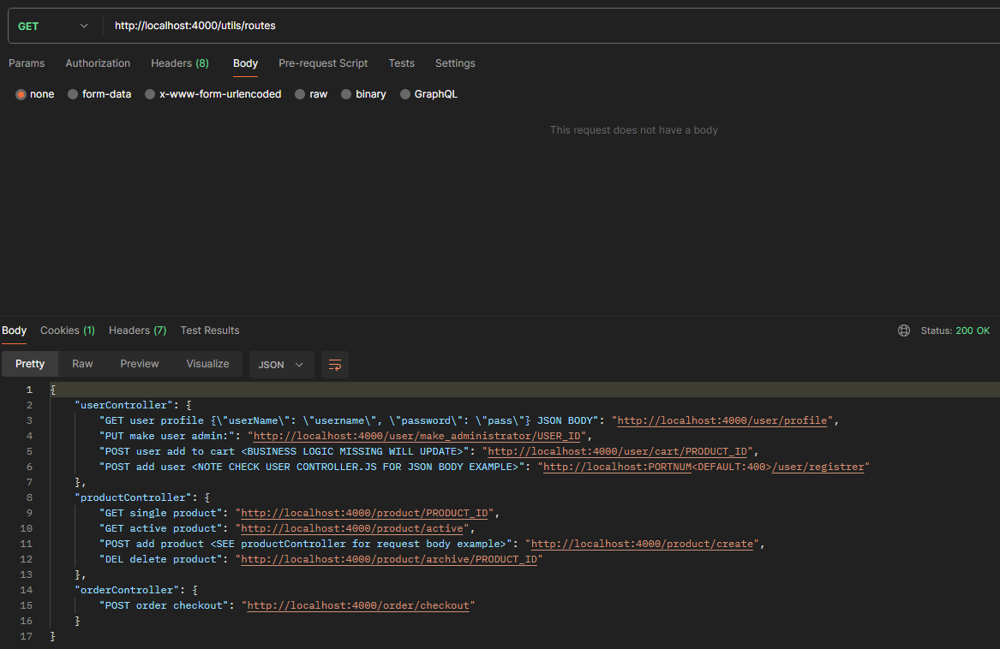

<a name="readme-top"></a>
<!-- TABLE OF CONTENTS -->
<details>
  <summary>Table of Contents</summary>
  <ol>
    <li>
      <a href="#about-the-project">About The Project</a>
      <ul>
        <li><a href="#built-with">Built With</a></li>
      </ul>
    </li>
    <li>
      <a href="#getting-started">Getting Started</a>
      <ul>
        <li><a href="#prerequisites">Prerequisites</a></li>
        <li><a href="#installation">Installation</a></li>
      </ul>
    </li>
       <li>
      <a href="#api-routes">Routes</a>
      <ul>
           <li><a href="#api-routes">API Routes</a></li>
      </ul>
    </li>
    <li><a href="#roadmap">Roadmap</a></li>
    <li><a href="#contributing">Contributing</a></li>

  </ol>
</details>


<!-- ABOUT THE PROJECT -->
## About The Project





A RESTful E-Commerce API that is built on Express and MongoDB Atlas. Project contains user, product, and order services to accomodate possible users.

<p align="right">(<a href="#readme-top">back to top</a>)</p>

### Built With


* [![nodejs.com][nodejs.com]][NODEJS-URL]
* [![expressjs.com][expressjs.com]][EXPRESS-URL]
* [![mongodb.com][mongodb.com]][MONGODB-URL]


<p align="right">(<a href="#readme-top">back to top</a>)</p>

<!-- GETTING STARTED -->
## Getting Started

Download all the prerequisites below in order.

### Prerequisites
Download all of these to get started. _Please also install packages used, this can be found in packages.json_

* [NodeJS](https://nodejs.org/en/download/)
* [Express](https://expressjs.com/en/starter/installing.html)


### Installation

_Once installed, open a command prompt, choose your directory wherein you want to save the project. Finally, clone the repo._


1. Clone the repo
   ```sh
   C:\Users\PC> git clone https://github.com/neekho/Express-E-Commerce-API.git
   ```
2. Go to the project folder
   ```sh
   C:\Users\PC> cd Express-E-Commerce-API.git (the base project folder name)
   ```
3. Open the project using your preferred editor
   
4. Install all necessary packages, refer to packages.json
   
5. Run the command node index.js to start the server locally.


_Once the local server is running, open up a browser and go to http://localhost:4000/utils/routes
to see if the local server is up and running. Along with possible routes._


<p align="right">(<a href="#readme-top">back to top</a>)</p>

___________________________________________________________________________________________________

### Routes


Go to _http://localhost:4000/utils/routes_ for a list of possible routes in the current version of this API, for a detailed version of what does each route do, go to API Routes section.


<p align="right">(<a href="#readme-top">back to top</a>)</p>

___________________________________________________________________________________________________


### API Routes

<h3>v1 Routes</h3>
Refer here for all the list of available routes in the API. You may use Postman or Curl in testing the endpoints or other API testing tools.

<h4>User</h4>

<h4>Product</h4>
<h4>Order</h4>


* [GET Routes](http://localhost:8080/api/v1/student/routes) _Returns all possible routess in JSON format_
* [GET List](http://localhost:8080/api/v1/student)  _See all existing students in the database._
* [GET Single Object Student](http://localhost:8080/api/v1/student/ID) _Provide a student id at the end of this url or else this will result in a 404._
* [POST Add Student](http://localhost:8080/api/v1/student/post)  _Create a student that will be save in the PostgreSQL database._
* [PUT Update Student](http://localhost:8080/api/v1/student/ID?email=new_value&name=new_name)  _Update existing student data. ID pertains to the student object that will be updated. The email and name is will be the data for that specified student_
* [DELETE Student](http://localhost:8080/api/v1/student/ID)  _Delete an existing student. Provide a student id at the end of this url._

<p align="right">(<a href="#readme-top">back to top</a>)</p>

___________________________________________________________________________________________________


<!-- ROADMAP -->
## Roadmap

- [ ] JWT safety
- [ ] Login and logout
- [ ] Hash user passwords


<p align="right">(<a href="#readme-top">back to top</a>)</p>

___________________________________________________________________________________________________

<!-- CONTRIBUTING -->
## Contributing

Contributions are what make the open source community such an amazing place to learn, and create. Any contributions you make are **greatly appreciated**.

If you have a suggestion that would make this better, please fork the repo and create a pull request. You can also simply open an issue with the tag "enhancement".
Don't forget to give the project a star! Thanks again!

1. Fork the Project
2. Create your Feature Branch (`git checkout -b feature/AmazingFeature`)
3. Commit your Changes (`git commit -m 'Add some AmazingFeature'`)
4. Push to the Branch (`git push origin feature/AmazingFeature`)
5. Open a Pull Request

<p align="right">(<a href="#readme-top">back to top</a>)</p>


<!-- MARKDOWN LINKS & IMAGES -->
<!-- https://www.markdownguide.org/basic-syntax/#reference-style-links -->
[product-screenshot]: images/screenshot.png


[nodejs.com]: https://img.shields.io/badge/node-74a867?style=for-the-badge&logo=node&logoColor=white
[NODEJS-URL]: https://nodejs.org/en


[expressjs.com]: https://img.shields.io/badge/express-121a13?style=for-the-badge&logo=express&logoColor=white
[EXPRESS-URL]: https://expressjs.com

[mongodb.com]: https://img.shields.io/badge/mongodb-32a852?style=for-the-badge&logo=mongodb&logoColor=white
[MONGODB-URL]: https://www.mongodb.com/cloud/atlas/lp/try4?utm_source=google&utm_campaign=search_gs_pl_evergreen_atlas_core_prosp-brand_gic-null_apac-ph_ps-all_desktop_eng_lead&utm_term=mongodb&utm_medium=cpc_paid_search&utm_ad=e&utm_ad_campaign_id=12212624359&adgroup=115749710543&cq_cmp=12212624359&gad_source=1&gclid=CjwKCAiAibeuBhAAEiwAiXBoJFEks3P9gPBahanfK_zudnNu9bZoU3Gid6wCerA7qfBjIlZmmkUmAxoC5RAQAvD_BwE

[PostgreSQL.org]: https://img.shields.io/badge/PostgreSQL-33415E?style=for-the-badge&logo=postgresql&logoColor=white
[PostgreSQL-url]: https://www.postgresql.org
